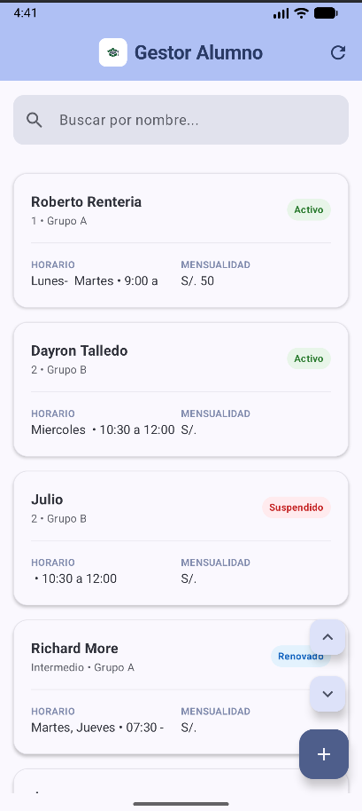
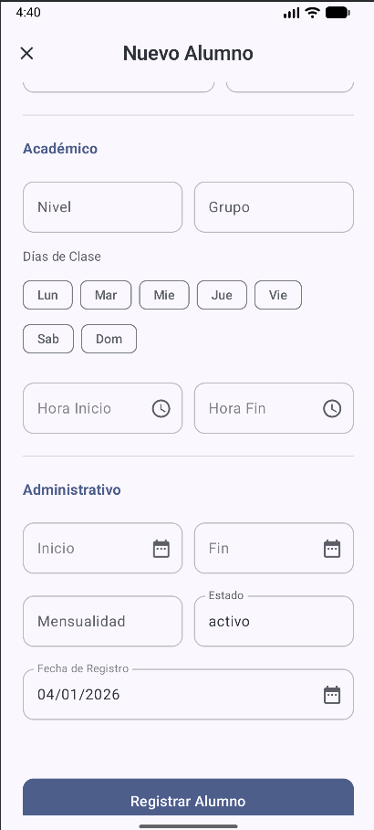

<table border="0">
  <tr>
    <td width="30%" align="center">
      
    </td>
    <td>
      <h1 border="0">Gestor Alumno 📱🎓</h1>
      <p>
        <strong>Gestor Alumno</strong> es una aplicación Android moderna y minimalista diseñada para la gestión eficiente de estudiantes.
      </p>
      <p>
        Construida con <strong>Kotlin</strong> y <strong>Jetpack Compose</strong>, utiliza <strong>Google Sheets</strong> como backend ligero y flexible, permitiendo un control total de los datos sin necesidad de servidores complejos.
      </p>
    </td>
  </tr>
</table>

## ✨ Características Principales

*   **Gestión Completa (CRUD):** Crear, Leer, Actualizar y Eliminar registros de alumnos.
*   **Interfaz Moderna y Limpia:** Diseño minimalista con **Material Design 3**.
*   **100% Responsiva:**
    *   📱 **Móvil:** Lista vertical optimizada y formularios de una sola columna.
    *   📟 **Tablet / Landscape:** Adaptación automática a cuadrícula (Grid) y formularios de doble columna.
*   **Búsqueda Inteligente:** Filtrado en tiempo real por nombre.
*   **Formularios Avanzados:**
    *   ⏰ Selección de horario con selectores de hora nativos (Inicio - Fin).
    *   📅 Fecha de registro editable con calendario nativo.
    *   🔓 Modo Edición con bloqueo de seguridad para evitar cambios accidentales.
*   **Backend Gratuito:** Utiliza Google Sheets + Google Apps Script.

## 🛠️ Stack Tecnológico

*   **Lenguaje:** [Kotlin](https://kotlinlang.org/)
*   **UI Toolkit:** [Jetpack Compose](https://developer.android.com/jetpack/compose)
*   **Arquitectura:** MVVM (Model-View-ViewModel)
*   **Red:** [Retrofit 2](https://square.github.io/retrofit/) + [Gson](https://github.com/google/gson)
*   **Concurrencia:** Kotlin Coroutines
*   **Iconos:** Material Icons Extended

## 🚀 Instalación y Configuración

Sigue estos pasos para ejecutar el proyecto en tu entorno local.

### 1. Clonar el repositorio

```bash
git clone https://github.com/Axel-the/Gestor-Alumno.git
cd gestor-alumno
```

### 2. Configurar el Backend (Google Sheets)

La aplicación requiere un backend funcional en Google Sheets.

1.  Crea una nueva hoja de cálculo en [Google Sheets](https://sheets.google.com).
2.  En la primera fila, añade las siguientes cabeceras (respetando el orden y mayúsculas si es necesario, aunque el script usa los nombres de las columnas para mapear el JSON):
    *   `nombres`, `apellidos`, `apoderado`, `email`, `telefono`, `nivel`, `grupo`, `dias`, `horario`, `fecha_inicio`, `fecha_fin`, `mensualidad`, `fecha_registro`, `estado`
3.  Ve a `Extensiones` > `Apps Script`.
4.  Copia el contenido del archivo `backend/code.gs` incluido en este proyecto y pégalo en el editor del script.
5.  Haz clic en **Implementar** > **Nueva implementación**.
6.  Selecciona el tipo **Aplicación web**.
7.  En **Quién tiene acceso**, selecciona **Cualquier usuario** (Anyone).
8.  Haz clic en **Implementar** y copia la **URL de la aplicación web** generada.

### 3. Conectar la App Android

1.  Abre el proyecto en **Android Studio**.
2.  Navega a `app/src/main/java/com/example/mvpparaandroid/network/RetrofitClient.kt`.
3.  Reemplaza el valor de `BASE_URL` con tu URL generada en el paso anterior. **IMPORTANTE:** Asegúrate de que la URL termine en `/`.

```kotlin
// Ejemplo
private const val BASE_URL = "https://script.google.com/macros/s/TU_ID_DE_SCRIPT/exec/"
```

4.  Sincroniza el proyecto con Gradle (`File` > `Sync Project with Gradle Files`).

### 4. Ejecutar

Conecta tu dispositivo Android o inicia un emulador y haz clic en el botón **Run** (▶️) en Android Studio.

## 📂 Estructura del Proyecto

```
com.example.mvpparaandroid
├── data
│   └── network         # Configuración de Retrofit y Servicios API
├── model               # Modelos de datos (Student, StudentSubmission)
├── repository          # Repositorio (Single Source of Truth)
└── ui
    ├── screens         # Pantallas (StudentListScreen, RegisterStudentScreen)
    ├── theme           # Tema y colores de la aplicación
    └── StudentUiState  # Estados de la UI
```

## 📸 Capturas de Pantalla

| Lista de Alumnos | Registro / Edición |
|:---:|:---:|
|  |  |

## 🤝 Contribución

Las contribuciones son bienvenidas. Por favor, abre un issue primero para discutir qué te gustaría cambiar.

## 📄 Licencia

Este proyecto está bajo la Licencia MIT.
